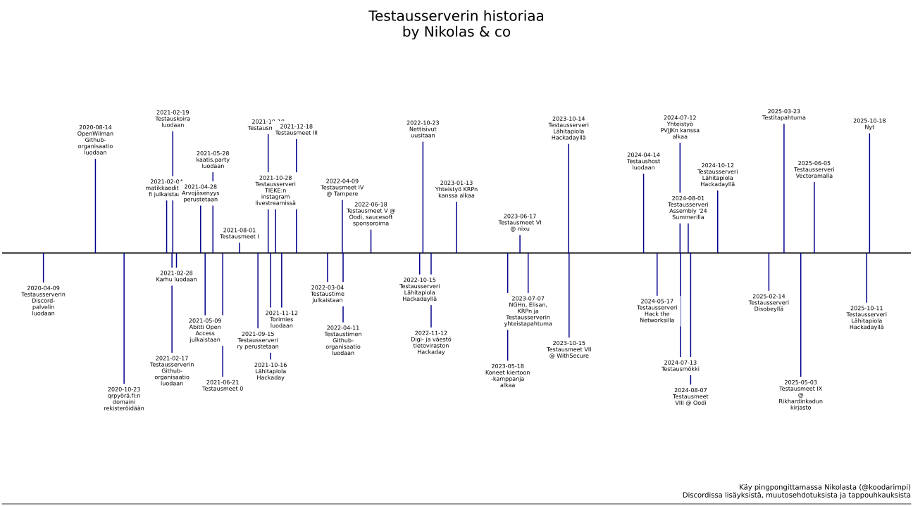

# Testaustimeline

An over engineered script to generate a timeline of Testausserveri history



## Installation & setup

0. Ensure python, pip and venv are installed
1. Create virtual environment and install dependencies
    
    ```sh
    python3 -m venv .venv
    python3 -m pip install -r requirements.txt
    ```
2. Get a Google Cloud Platform API key
3. Ensure your sheet is set to be viewable by anyone with a link.
4. Set environment variables `GCP_API_KEY` and `SHEETS_ID`. You can use a dotenv file.  
   `GCP_API_KEY` is the key you just generated and `SHEETS_ID` is the lon hexadecimal in the sheet link.

> [!TIP]  
> The `SHEETS_ID` of the main spreadsheet is `18frYouif8XON7jsx3Cf50qABWK4O32Dkrz9Aaqq9FUs`.

## Usage
1. Run
   ```sh
   python3 testaustimeline.py
   ```
2. Follow the instructions.  
   Note that generating the timeline might take a few tries as the algorithm positioning the labels was programmed at 3 AM.


## Licensing

&copy; 2025 Testausserveri ry and Nikolas Lehto  
Licensed under the MIT No Attribution (`MIT-0`) License
